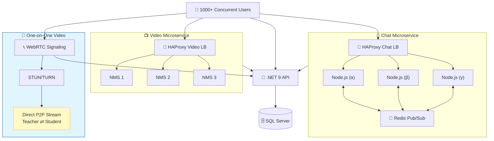

# Ahmed Yasser

  

  
  
  

  
  

---

## 👨‍💻 **The Developer & The Human**

> *"Software engineer by trade, explorer of the human condition by heart."*

I exist at the intersection of **logical systems** and **creative chaos**. By day, I architect scalable backend systems that handle thousands of concurrent users. By night, I deconstruct the intricate dance of sociology, economics, and philosophy—the invisible threads that connect culture and human behavior.

**🔹 Academic Excellence**  
Business Information Systems student at Helwan University with a **3.97/4.0 GPA**—bridging the gap between technical implementation and business strategy. Certified by NVIDIA, Udemy, and Coursera, I'm passionate about learning, collaboration, and building impactful software.

**🔹 Engineering Philosophy**  
I don't just use technologies; I understand how they work. I believe a true software engineer should not be bound by technology, but able to adapt to any stack or environment. My approach: *centralize control, distribute the work, keep it simple.* Every line of code is an opportunity to build something that outlasts its immediate purpose.

**🔹 Beyond Code**  
I have a strong understanding of business processes and enjoy connecting technology with business, humanities, and social sciences to create practical, **human-centered solutions**. Curious and adaptable, I thrive in multicultural environments and value diversity in all its forms.

---

## 💼 **Professional Experience**

### **Software Engineering Intern** @ Proceedit (Remote, Barcelona)

- Delivered scalable backend solutions by developing **Python/Flask microservices** and **GraphQL APIs** in an Agile (Kanban) environment using Jira and Confluence
- Improved system performance and reliability by managing **PostgreSQL databases** and interacting with **Kubernetes** and the **Exoscale cloud platform**
- have a contribution to the design of a modular internal **LLM engine architecture** that alternates specialized small models to reduce hardware costs and improve scalability for AI operations such as chatbots, content generation, reporting, and coding assistance

---

## 🏗️ **Featured Project: Ahmedrix Educational Ecosystem**

  
  ### **⚡ 13 Docker Containers — Zero Third-Party Dependencies — 1 Developer ⚡**
  

A complete learning platform where teachers connect with thousands of students through:

| Feature | Implementation |
|---------|---------------|
| 📺 **Live Streaming** | RTMP ingestion with Node Media Server cluster |
| 💬 **Real-time Chat** | Horizontally scaled Node.js with Redis Pub/Sub backplane |
| 🤝 **One-on-One Video** | Custom WebRTC Signaling Server with direct P2P connections |
| 📚 **Course Management** | .NET 9 MVC with SQL Server and MediatR |

```mermaid
flowchart TB
    User["👤 1000+ Concurrent Users"] --> LB1["🚦 HAProxy Chat LB"]
    User --> LB2["🚦 HAProxy Video LB"]
    User --> API["🎯 .NET 9 API"]
    User --> WebRTC["📞 WebRTC Signaling"]
    
    subgraph ChatCluster["💬 Chat Microservice"]
        direction TB
        LB1 --> C1["Node.js (α)"] 
        LB1 --> C2["Node.js (β)"] 
        LB1 --> C3["Node.js (γ)"]
        C1 <--> Redis["📨 Redis Pub/Sub"]
        C2 <--> Redis
        C3 <--> Redis
    end
    
    subgraph VideoCluster["📺 Video Microservice"]
        direction TB
        LB2 --> V1["NMS 1"] 
        LB2 --> V2["NMS 2"] 
        LB2 --> V3["NMS 3"]
    end
    
    subgraph P2P["🤝 One-on-One Video"]
        WebRTC --> Signal["STUN/TURN"]
        Signal --> Direct["Direct P2P Stream<br/>Teacher ⇄ Student"]
    end
    
    API --> DB[("🗄️ SQL Server")]
    ChatCluster --> API
    VideoCluster --> API
    WebRTC --> API
    
    style P2P fill:#e1f5fe,stroke:#01579b
    style Direct fill:#fff9c4,stroke:#fbc02d
```

**Key Architectural Achievements:**
- **Core Authority (.NET 9 MVC):** The Main Platform and the Single Source of Truth using ASP.NET Core 9; all system state and SQL Server persistence are managed exclusively by the core API
- **Distributed Chat Engine:** Developed a standalone Node.js messaging service using Redis Pub/Sub to synchronize state across multiple nodes, managed by HAProxy with Sticky Sessions for WebSocket stability
- **Mass Broadcasting Infrastructure:** Built and integrated Node Media Server clusters with HAProxy to handle high-bandwidth RTMP ingestion, enabling seamless live streaming to thousands of concurrent viewers
- **Interactive P2P Video:** Developed a custom WebRTC Signaling Server to facilitate zero-latency, private one-on-one video sessions between instructors and students, optimizing server resources through direct peer-to-peer data transfer
- **Traffic Control:** Deployed HAProxy to manage active health checks and millisecond failover, routing users to the least-loaded edge nodes for optimal real-time performance
- **Hybrid Orchestration:** Engineered a 13-container Docker ecosystem that decouples high-concurrency tasks (Video/Chat) from core business logic, ensuring 99.9% system availability through loose coupling

## 🛠️ **Technical Arsenal**

### **Backend Core**

  
  
  
  
  
  
  
  

### **Data & Storage**

  
  
  
  
  
  

### **DevOps & Infrastructure**

  
  
  
  
  
  

### **Real-Time Communication**

  
  
  
  
  

### **API & Development Tools**

  
  
  
  

### **Desktop Development**

  

### **Tools & Methodologies**

  
  
  
  
  
  
  

### **Architecture & Design**

  
  
  
  
  

---

## 🧠 **Intellectual Pursuits**

Beyond software engineering, I'm deeply engaged with the **Humanities and Social Sciences**—the "social operating system" we all inhabit. From the intricate dance of Sociology and Economics to the deep rabbit holes of Philosophy and Thought, I've always been fascinated by the invisible threads that connect culture and human behavior.

### **📚 Recent Reading**

| Category | Works |
|---------|-------|
| **Economic Systems** | *Development as Freedom* — Amartya Sen *The Great Transformation* — Karl Polanyi *Blockchain Revolution* — Don & Alex Tapscott |
| **Sociological Theory** | *The Elementary Forms of Religious Life* — Émile Durkheim *Suicide* — Émile Durkheim *The Division of Labour in Society* — Émile Durkheim |
| **Software Engineering** | *Programming WebRTC: Build Real-Time Streaming Applications for the Web* — Karl Stolley |

### **🌍 Languages**
- **English** — Fluent (C1)
- **Arabic** — Native
- **Chinese** — Intermediate (B1)

---

## 🎵 **The Sonic Landscape**

Music is my gateway to different cultures and emotional states:

| Tradition | Artists / Composers |
|----------|---------------------|
| **Classical Arabic** | Omar Khairat, Fairuz |
| **Persian Classical** | Various traditional artists |
| **Hebrew** | Liturgical and folk traditions |
| **Western Classical** | Beethoven, Chopin |
| **French Chanson** | Dalida, Lara Fabian, Joe Dassin |
| **Film Scores** | Instrumental cinema compositions |

---

## 🌆 **Beyond the Screen**

I'm someone who lives for curiosity: hidden city corners, wild theories, and art that actually makes you feel something. Whether it's wandering through a museum, tasting a dish I can't pronounce, or discovering a hidden corner of a city, I love the thrill of experiencing something new.

**What draws me in:**
- Visiting art museums and historical sites
- Listening to classical and traditional music from different cultures
- Reading literature and reflective nonfiction
- Writing personal essays and social commentary
- Exploring different neighborhoods and observing everyday life
- Long walks for thinking and reflection
- Learning languages and engaging with other cultures
- Attending public lectures or cultural events

I'm drawn to the **bold and unpredictable**—people who can swing between quiet reflection and high energy, those who embrace both the light and the shadow of life. I love conversations that wander, ideas that challenge my perspective, and stories that stick with you long after the night ends.

**I value:** honesty, curiosity, kindness, and a little mischief. The best connections come from laughter, adventure, and the joy of discovering someone who surprises you.

---

## 🤝 **Volunteer Work**

### **Project Team Member** — International Relations Office, Helwan University
*Helwan, Egypt | 2023 - Present*

- Organized and managed official events and visits with international delegations, ensuring professional representation of the institution
- Supported faculty members and researchers in securing funding by analyzing requirements of international programs such as **Erasmus+** and **Interreg NEXT MED**, guiding them through application and compliance processes

---

## 📊 **GitHub Analytics**

  

---

## 📫 **Let's Connect**

I'm always open to collaborating on impactful projects, discussing software architecture, or exploring the intersection of technology and human experience.

  <table>
    <tr>
      <td align="center">
        <a href="https://www.linkedin.com/in/ahmed-yasser-212b5b28b/">
           
          Professional Network
        </a>
      </td>
      <td align="center">
        <a href="mailto:ahmedyassermonet@gmail.com">
           
          ahmedyassermonet
        </a>
      </td>
      <td align="center">
        <a href="https://wa.me/00201023131109">
           
          +20 102 313 1109
        </a>
      </td>
    </tr>
  </table>

**Bonus points if you can:**
- Explain a complex idea or niche economic theory
- Share a wild theory that makes me question reality
- Show me music or art I've completely overlooked

---

  
  ### ⚡ **"Centralize control, distribute the work, keep it simple."** ⚡
  
  *Software engineer by trade, explorer of the human condition by heart.*
  
  
  

