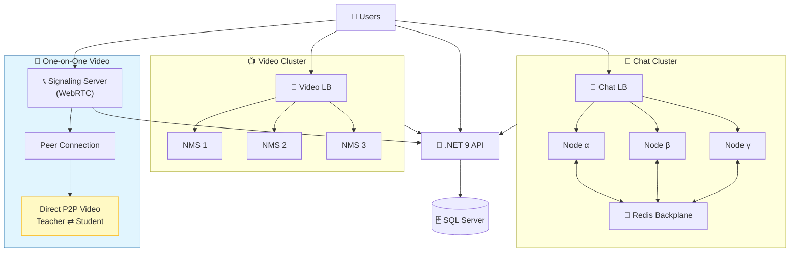

## Ahmed Yasser - Software Engineer

<div align="center">
  <a href="https://www.linkedin.com/in/ahmed-yasser-212b5b28b/" target="_blank">
    
  </a>
  <a href="ahmedyassermonet@gmail.com" target="_blank">
    
  </a>
  <a href="https://wa.me/00201023131109" target="_blank">
    
  </a>
</div>

###

<h1 align="center">👋 Hey there, I'm Ahmed Yasser</h1>

###

<h3 align="center">Software Engineer | BIS Student (GPA: 3.97/4.0)</h3>

###

<div align="center">
  
  
</div>

---

## 🚀 About Me

I'm a Software Engineer and Business Information Systems student passionate about building **efficient, scalable, and well-structured software solutions** from the ground up. I don't just use technologies — I understand how they work and architect systems that can handle thousands of users.

🔹 **What drives me:**
- Designing and optimizing backend systems
- Building distributed architectures with zero third-party dependencies
- Solving complex problems with clean, maintainable code
- Bridging theory with practice through system analysis and architecture

🌍 **Beyond coding:** I have a deep appreciation for history, philosophy, and languages. I'm fluent in Arabic and English, currently learning Chinese. I also enjoy classical music, football, and exploring art and cultural heritage.

---

## 💡 Featured Project: Ahmedrix Educational Ecosystem

<div align="center">
  
  ### **⚡ Built From Scratch — 13 Docker Containers — 1 Developer ⚡**
  
</div>

A complete learning platform where teachers can:
- 📺 **Live stream** to thousands of students
- 💬 **Real-time chat** with message history
- 🤝 **One-on-one video calls** (private sessions)
- 📚 **Manage courses** and student enrollments

**The twist?** No third-party APIs, no plug-and-play services. Just clean code and solid architecture.


```mermaid
flowchart TB
    User["👤 Users"] --> LB1["🚦 Chat LB"]
    User --> LB2["🚦 Video LB"]
    User --> API["🎯 .NET 9 API"]
    User --> WebRTC["📞 Signaling Server<br/>(WebRTC)"]
    
    subgraph Chat["💬 Chat Cluster"]
        LB1 --> C1["Node α"] & C2["Node β"] & C3["Node γ"]
        C1 <--> Redis["📨 Redis Backplane"]
        C2 <--> Redis
        C3 <--> Redis
    end
    
    subgraph Video["📺 Video Cluster"]
        LB2 --> V1["NMS 1"] & V2["NMS 2"] & V3["NMS 3"]
    end
    
    subgraph OneOnOne["🤝 One-on-One Video"]
        WebRTC --> Signal["Peer Connection"]
        Signal --> P2P["Direct P2P Video<br/>Teacher ⇄ Student"]
    end
    
    API --> DB[("🗄️ SQL Server")]
    Chat --> API
    Video --> API
    WebRTC --> API
    
    style OneOnOne fill:#e1f5fe,stroke:#01579b
    style P2P fill:#fff9c4,stroke:#fbc02d
```

---

## 🛠️ Technical Arsenal

### **Backend Development**
<div align="left">
  
  
  
  
</div>

### **Databases & Caching**
<div align="left">
  
  
  
  
</div>

### **DevOps & Containerization**
<div align="left">
  
  
  
  
</div>

### **Real-Time & Web Technologies**
<div align="left">
  
  
  
  
  
  
</div>

### **Tools & IDEs**
<div align="left">
  
  
  
  
</div>

---
---

## 📫 Let's Connect

I'm always open to collaborating on impactful projects or discussing software architecture!

<div align="center">
  <a href="https://www.linkedin.com/in/ahmed-yasser-212b5b28b/">
    
  </a>
  <a href="mailto:ahmedyassermonet@gmail.com">
    
  </a>
  <a href="https://wa.me/00201023131109">
    
  </a>
</div>

---

<div align="center">
  
  ### ⚡ **"Centralize control, distribute the work, keep it simple."** ⚡
  
  *— Ahmed Yasser,Developer*
  
  
  
</div>
```

---
